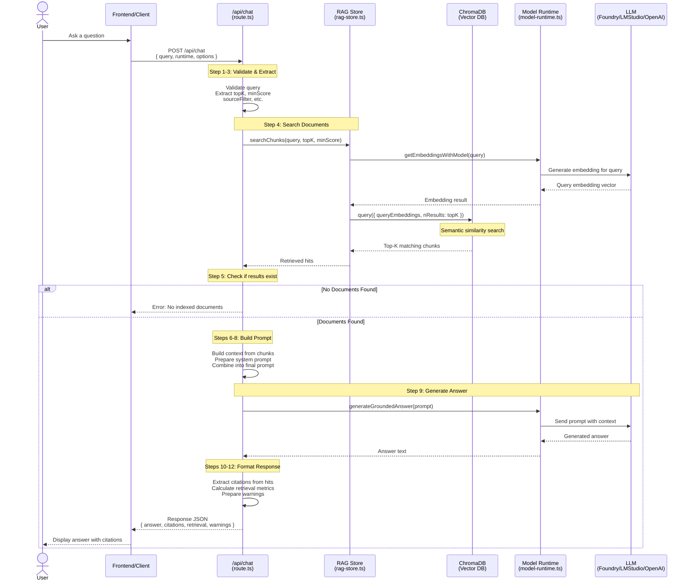
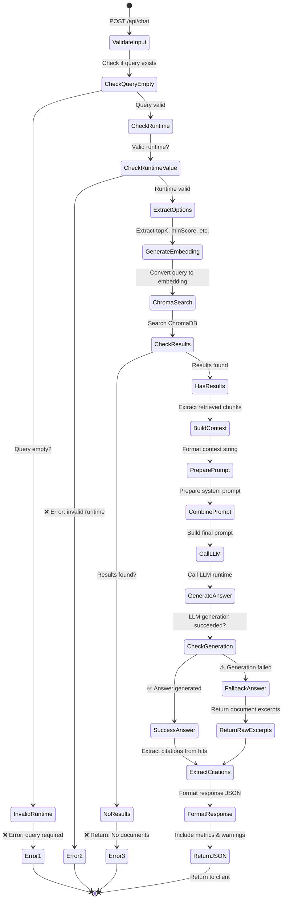
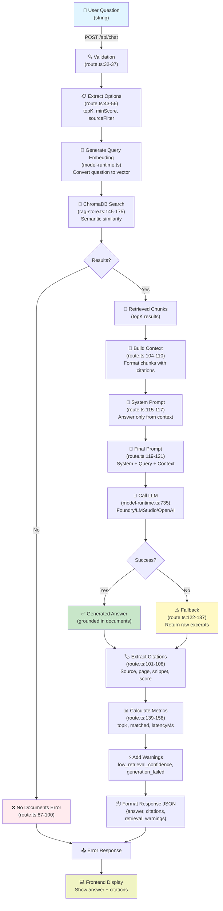

# Chat Flow: From User Question to Software Response

This document traces the complete flow of how the Local RAG Studio processes a user's question and returns a grounded answer. Each step includes specific code references.

---

## Overview Diagram

```
User Question
    ↓
POST /api/chat
    ↓
Validate & Extract Query
    ↓
Search ChromaDB for Relevant Documents
    ↓
Build Context from Retrieved Chunks
    ↓
Call LLM with System Prompt + Context
    ↓
Generate Grounded Answer
    ↓
Return Answer + Citations
```

### Mermaid Sequence Diagram



### Mermaid State Diagram



### Mermaid Data Flow Diagram



---

## Step-by-Step Flow

### Step 1: User Submits Question (POST Request)

**Location:** [src/app/api/chat/route.ts](src/app/api/chat/route.ts#L23-L31)

```typescript
export async function POST(req: Request) {
  let body: ChatRequest;

  try {
    body = (await req.json()) as ChatRequest;
  } catch {
    return Response.json({ error: 'Invalid request body' }, { status: 400 });
  }
```

**What happens:**
- User sends a POST request to `/api/chat` with a JSON body containing:
  - `query`: The user's question
  - `runtime`: Which LLM runtime to use (foundry, lmstudio, or openai)
  - `options`: Optional settings (topK, minScore, model selection, etc.)

---

### Step 2: Validate Query Parameter

**Location:** [src/app/api/chat/route.ts](src/app/api/chat/route.ts#L32-L37)

```typescript
const query = body.query?.trim();
if (!query) {
  return Response.json({ error: 'query is required' }, { status: 400 });
}

const runtime = body.runtime || 'lmstudio';
if (runtime !== 'foundry' && runtime !== 'lmstudio' && runtime !== 'openai') {
  return Response.json({ error: 'runtime must be foundry, lmstudio, or openai' }, { status: 400 });
}
```

**What happens:**
- Validates that a non-empty `query` is provided
- Validates that `runtime` is one of the supported options
- Sets default runtime to 'lmstudio' if not specified

---

### Step 3: Extract Configuration Options

**Location:** [src/app/api/chat/route.ts](src/app/api/chat/route.ts#L43-L56)

```typescript
const topK = body.options?.topK ?? 5;
const minScore = body.options?.minScore ?? 0.2;
const sourceFilter = body.options?.sourceFilter?.map(item => item.trim()).filter(Boolean) ?? [];
const embeddingModelId = body.options?.embeddingModelId?.trim();
const embeddingRuntime = body.options?.embeddingRuntime;
const llmBaseUrl = body.options?.llmBaseUrl?.trim();
const llmApiKey = body.options?.llmApiKey?.trim();
const embeddingBaseUrl = body.options?.embeddingBaseUrl?.trim();
const embeddingApiKey = body.options?.embeddingApiKey?.trim();
const vectorDbUrl = body.options?.vectorDbUrl?.trim();
```

**What happens:**
- Extract RAG search parameters:
  - `topK`: Number of document chunks to retrieve (default: 5)
  - `minScore`: Minimum similarity score threshold (default: 0.2)
  - `sourceFilter`: Which documents to search in (optional)
- Extract remote configuration for custom LLM/embedding endpoints

---

### Step 4: Search ChromaDB for Relevant Documents

**Location:** [src/app/api/chat/route.ts](src/app/api/chat/route.ts#L59-C75)

```typescript
let hits: Awaited<ReturnType<typeof searchChunks>>;
try {
  hits = await searchChunks(
    runtime,
    query,
    topK,
    minScore,
    sourceFilter,
    embeddingModelId,
    embeddingRuntime,
    {
      baseUrl: embeddingBaseUrl,
      apiKey: embeddingApiKey,
    },
    vectorDbUrl,
  );
```

**The searchChunks function:** [src/lib/rag-store.ts](src/lib/rag-store.ts#L145-L175)

```typescript
export async function searchChunks(
  runtime: RuntimeName,
  query: string,
  topK: number,
  minScore: number,
  sourceFilter?: string[],
  embeddingModelId?: string,
  embeddingRuntime?: RuntimeName,
  remote?: RemoteApiAuth,
  vectorDbUrl?: string,
) {
  // Step 4a: Generate embedding for user's query
  const queryEmbedding = (
    await getEmbeddingsWithModel(
      embeddingRuntime ?? runtime,
      [query],
      embeddingModelId,
      remote,
    )
  ).embeddings;
  
  // Step 4b: Connect to ChromaDB
  const collection = await getCollection(vectorDbUrl);
  const cleanSourceFilter = (sourceFilter ?? []).map(item => item.trim()).filter(Boolean);

  // Step 4c: Query ChromaDB with similarity search
  const results = await collection.query({
    queryEmbeddings: queryEmbedding,
    nResults: topK,
    include: ['documents', 'metadatas', 'distances'],
    where:
      cleanSourceFilter.length > 0
        ? { source: { $in: cleanSourceFilter } }
        : undefined,
  });
```

**What happens:**
1. **Convert query to embedding**: The user's question is converted to a vector embedding using the embedding model
2. **Connect to ChromaDB**: Establishes connection to the vector database
3. **Semantic search**: ChromaDB finds the top-K document chunks that are semantically similar to the query
4. **Filter by source**: If `sourceFilter` is provided, only searches within those specific documents

---

### Step 5: Handle No Results Case

**Location:** [src/app/api/chat/route.ts](src/app/api/chat/route.ts#L87-C100)

```typescript
if (hits.length === 0) {
  return Response.json({
    answer:
      sourceFilter.length > 0
        ? 'No matches found in the selected document scope. Broaden the scope or ingest more files.'
        : 'No indexed documents found. Ingest files first, then retry your question.',
    citations: [],
    retrieval: {
      topK,
      matched: 0,
      latencyMs: Date.now() - start,
    },
    warnings: ['no_indexed_chunks'],
  });
}
```

**What happens:**
- If no document chunks match the query, the system **does not** generate a hallucinated answer
- Returns an explicit message telling the user why no answer could be provided
- This enforces the "ground in documents only" principle

---

### Step 6: Build Context from Retrieved Chunks

**Location:** [src/app/api/chat/route.ts](src/app/api/chat/route.ts#L104-C110)

```typescript
const context = hits
  .map(
    (item, index) =>
      `[${index + 1}] Source: ${item.source}${item.page !== null ? ` (page ${item.page})` : ''}\n${item.text}`,
  )
  .join('\n\n---\n\n');
```

**What happens:**
- Formats all retrieved document chunks into a single context string
- Each chunk is numbered [1], [2], [3], etc. for citation purposes
- Includes source document name and page number (if available)
- Chunks are separated by `---` for clarity

**Example context:**
```
[1] Source: document1.pdf (page 3)
The quick brown fox jumps over the lazy dog...

---

[2] Source: document2.pdf (page 12)
Lorem ipsum dolor sit amet, consectetur adipiscing elit...
```

---

### Step 7: Prepare System Prompt

**Location:** [src/app/api/chat/route.ts](src/app/api/chat/route.ts#L115-C117)

```typescript
const systemPrompt =
  body.options?.systemPrompt?.trim() ||
  'Answer only from the provided context. If the context is insufficient, explicitly say what is missing. Include citations like [1], [2].';
```

**What happens:**
- **KEY ENFORCEMENT**: Sets the system prompt that tells the LLM to answer only from the provided documents
- Allows custom system prompts to be provided via `options.systemPrompt`, but has a sensible default
- This prompt is the primary mechanism that prevents the LLM from using its general knowledge

---

### Step 8: Build Final Prompt for LLM

**Location:** [src/app/api/chat/route.ts](src/app/api/chat/route.ts#L119-C121)

```typescript
answer = await generateGroundedAnswer({
  runtime,
  modelId,
  prompt: `${systemPrompt}\n\nQuestion:\n${query}\n\nContext:\n${context}\n\nReturn a concise answer with citations.`,
  timeoutMs: 45_000,
  remote: {
    baseUrl: llmBaseUrl,
    apiKey: llmApiKey,
  },
});
```

**What happens:**
- Combines:
  1. System prompt (enforcing document-only answers)
  2. User's question
  3. Retrieved document context
  4. Instructions to include citations
- This complete prompt is sent to the LLM

**Example final prompt structure:**
```
Answer only from the provided context. If the context is insufficient, explicitly say what is missing. Include citations like [1], [2].

Question:
What is the capital of France?

Context:
[1] Source: geography.pdf (page 5)
France is a country in Western Europe...

---

[2] Source: capitals.pdf (page 12)
Paris is the capital of France and the largest city in the country...

Return a concise answer with citations.
```

---

### Step 9: Call LLM to Generate Answer

**Location:** [src/lib/model-runtime.ts](src/lib/model-runtime.ts#L735-C763)

```typescript
export async function generateGroundedAnswer(args: {
  runtime: RuntimeName;
  modelId?: string;
  prompt: string;
  timeoutMs?: number;
  remote?: RemoteApiAuth;
}): Promise<string> {
  const modelId = args.modelId?.trim() || getDefaultChatModel(args.runtime);
  
  if (args.runtime === 'openai') {
    return generateWithOpenAICompatible(modelId, args.prompt, args.timeoutMs ?? 45_000, args.remote);
  }
  if (args.runtime === 'lmstudio') {
    return generateWithLmStudio(modelId, args.prompt, args.timeoutMs ?? 45_000, args.remote);
  }

  // Foundry runtime
  const result = await runCommandWithInput(
    FOUNDRY_BINARIES[0],
    ['model', 'run', modelId],
    args.prompt,
    args.timeoutMs ?? 45_000,
  );
```

**What happens:**
- Routes the request to the appropriate LLM runtime:
  - **OpenAI**: Uses OpenAI API (gpt-4o-mini, etc.)
  - **LMStudio**: Uses local LMStudio instance via HTTP API
  - **Foundry**: Uses Microsoft Foundry local runtime via CLI
- Sets timeout to 45 seconds
- Passes the complete prompt (system + context + question) to the model

---

### Step 10: Extract Citations

**Location:** [src/app/api/chat/route.ts](src/app/api/chat/route.ts#L101-C108)

```typescript
const citations = hits.map(item => ({
  source: item.source,
  page: item.page,
  chunk_id: item.id,
  snippet: item.text.slice(0, 220),
  score: item.score,
}));
```

**What happens:**
- Creates a citations array with metadata for each document chunk:
  - `source`: Document filename
  - `page`: Page number in the document
  - `chunk_id`: Unique identifier for the chunk
  - `snippet`: First 220 characters of the chunk
  - `score`: Semantic similarity score (0-1)

---

### Step 11: Handle Generation Errors (Fallback)

**Location:** [src/app/api/chat/route.ts](src/app/api/chat/route.ts#L122-C137)

```typescript
let answer: string;
let generationWarning: string | undefined;
try {
  answer = await generateGroundedAnswer({
    runtime,
    modelId,
    prompt: ...,
    timeoutMs: 45_000,
    remote: {...},
  });
} catch (error) {
  generationWarning =
    error instanceof Error ? `generation_failed: ${error.message}` : 'generation_failed';

  answer = [
    'Model generation unavailable. Returning retrieved context excerpts:',
    ...hits.map(
      (item, index) =>
        `[${index + 1}] ${item.text.slice(0, 260).trim()} (${item.source})`,
    ),
  ].join('\n\n');
}
```

**What happens:**
- If the LLM fails to generate an answer, the system has a fallback
- Returns the raw document excerpts instead of an error
- Still maintains citations and grounding in documents
- Records the warning for debugging

---

### Step 12: Return Response with Metadata

**Location:** [src/app/api/chat/route.ts](src/app/api/chat/route.ts#L139-C158)

```typescript
return Response.json({
  answer,
  citations,
  retrieval: {
    topK,
    matched: hits.length,
    latencyMs: Date.now() - start,
  },
  warnings: [
    ...(hits.length < 2
      ? ['low_retrieval_confidence_only_one_chunk_matched']
      : []),
    ...(generationWarning ? [generationWarning] : []),
  ],
});
```

**What happens:**
- Returns a complete JSON response with:
  - `answer`: The LLM-generated answer grounded in documents
  - `citations`: References to the source documents and chunks
  - `retrieval`: Metadata about the search (how many chunks matched, latency)
  - `warnings`: Any issues encountered during processing (e.g., "only_one_chunk_matched", "generation_failed")

**Example response:**
```json
{
  "answer": "Based on the provided context, Paris is the capital of France [1]. It is the largest city in the country [2].",
  "citations": [
    {
      "source": "geography.pdf",
      "page": 5,
      "chunk_id": "geography.pdf::2",
      "snippet": "France is a country in Western Europe...",
      "score": 0.92
    },
    {
      "source": "capitals.pdf",
      "page": 12,
      "chunk_id": "capitals.pdf::1",
      "snippet": "Paris is the capital of France and the largest city in the country...",
      "score": 0.88
    }
  ],
  "retrieval": {
    "topK": 5,
    "matched": 2,
    "latencyMs": 1243
  },
  "warnings": []
}
```

---

## Model Types & Usage

The Local RAG Studio uses **two categories of models** for different purposes:

### 1. **Embedding Models** (for Vector Search)

Convert text into numerical vectors for semantic similarity matching in ChromaDB.

| Runtime | Default Model | Alternative Models | Purpose |
|---------|---------------|-------------------|---------|
| **Foundry** | `nomic-embed-text-v1` | `text-embedding-nomic-embed-text-v1.5`, `nomic-embed-text-v1.5` | Embed documents & queries for search |
| **LMStudio** | `text-embedding-nomic-embed-text-v1.5` | Any embedding model loaded in LMStudio | Embed documents & queries for search |
| **OpenAI** | `text-embedding-3-small` | `text-embedding-3-large` | Embed documents & queries for search |

**Used in:** Step 4 - [src/lib/rag-store.ts](src/lib/rag-store.ts#L149-L157)

```typescript
const queryEmbedding = (
  await getEmbeddingsWithModel(
    embeddingRuntime ?? runtime,
    [query],
    embeddingModelId,  // Converts text → vector
    remote,
  )
).embeddings;
```

---

### 2. **Chat/LLM Models** (for Answer Generation)

Generate human-readable answers based on retrieved context.

#### Foundry Models:
| Model | Size | Type | Use Case |
|-------|------|------|----------|
| `phi-4-mini-reasoning` | Mini | Reasoning | Complex reasoning questions |
| `phi-4-reasoning` | Large | Reasoning | In-depth analysis |
| `phi-4` | Large | General | General chat & RAG |
| `phi-3.5-mini` | Mini | General | Fast responses |

**Default preference:** `phi-4-mini-reasoning` > `phi-4` > `phi-3.5-mini`

**Location:** [src/lib/model-runtime.ts](src/lib/model-runtime.ts#L58-L67)

```typescript
const PREFERRED_FOUNDRY_MODELS = [
  'phi-4-mini-reasoning',
  'phi-4',
  'phi-4-mini',
  'phi-3.5-mini',
  'qwen2.5-7b',
];
```

#### LMStudio Models:
| Model | Provider | Use Case |
|-------|----------|----------|
| `qwen/qwen3-vl-8b` | Qwen | Vision + language tasks |
| `qwen2.5-7b-instruct` | Qwen | General instruction following |
| `qwen2.5-coder-7b-instruct` | Qwen | Code understanding & generation |
| `llama-3.1-8b-instruct` | Meta | General chat & instruction |

**Location:** [src/lib/model-runtime.ts](src/lib/model-runtime.ts#L69-L74)

```typescript
const PREFERRED_LMSTUDIO_MODELS = [
  'qwen/qwen3-vl-8b',
  'qwen2.5-7b-instruct',
  'qwen2.5-coder-7b-instruct',
  'llama-3.1-8b-instruct',
];
```

#### OpenAI Models:
| Model | Capabilities | Cost | Use Case |
|-------|-------------|------|----------|
| `gpt-4o-mini` | Fast, capable | Low | General RAG, fast responses |
| `gpt-4.1-mini` | Balanced | Medium | Balanced performance |
| `gpt-4.1` | Most capable | High | Complex reasoning |

**Location:** [src/lib/model-runtime.ts](src/lib/model-runtime.ts#L76-L80)

```typescript
const PREFERRED_OPENAI_MODELS = [
  'gpt-4o-mini',
  'gpt-4.1-mini',
  'gpt-4.1',
];
```

**Used in:** Step 9 - [src/lib/model-runtime.ts](src/lib/model-runtime.ts#L735-L750)

```typescript
export async function generateGroundedAnswer(args: {
  runtime: RuntimeName;
  modelId?: string;  // Chat model for generating answer
  prompt: string;
  timeoutMs?: number;
  remote?: RemoteApiAuth;
}): Promise<string>
```

---

### How Models Are Used in the Chat Flow

```
User Question
    ↓
[EMBEDDING MODEL]
    ↓ Converts query to vector
    ↓
Search ChromaDB for similar documents
    ↓
Retrieve top-K relevant chunks
    ↓
Build context from chunks
    ↓
[CHAT/LLM MODEL]
    ↓ Reads system prompt + context + question
    ↓
Generate grounded answer
    ↓
Return answer + citations
```

---

### Model Selection Strategy

**Location:** [src/lib/model-runtime.ts](src/lib/model-runtime.ts#L92-L110)

The system automatically selects the best available model based on:

1. **Preferred models list** - Models are ranked by performance/preference
2. **Downloaded status** - Local models are preferred over needing download
3. **Alphabetical order** - Tiebreaker if preference is equal

```typescript
function bestModelRank(runtime: RuntimeName, modelId: string): number {
  const normalized = normalizeKey(modelId);
  const preferred = runtime === 'foundry' ? PREFERRED_FOUNDRY_MODELS : ...;
  
  const exact = preferred.findIndex(item => normalizeKey(item) === normalized);
  if (exact >= 0) return exact;  // Exact match is best
  
  const partial = preferred.findIndex(item => normalized.includes(...));
  if (partial >= 0) return partial + 10;  // Partial match is second
  
  return 999;  // Unknown models ranked last
}

function sortModels(runtime: RuntimeName, models: RuntimeModel[]): RuntimeModel[] {
  return [...models].sort((a, b) => {
    const rankDiff = bestModelRank(runtime, a.id) - bestModelRank(runtime, b.id);
    if (rankDiff !== 0) return rankDiff;
    
    if (a.downloaded !== b.downloaded) {
      return a.downloaded ? -1 : 1;  // Downloaded models first
    }
    
    return a.id.localeCompare(b.id);  // Alphabetical tiebreaker
  });
}
```

---

### Runtime Selection

The system supports three runtimes, each with different model availability:

| Runtime | Execution | Models | Default | Best For |
|---------|-----------|--------|---------|----------|
| **Foundry** | Local CLI | Foundry-optimized models | Recommended | Privacy, control, fastest |
| **LMStudio** | Local HTTP API | LMStudio library | Fallback | Flexibility, multiple model sources |
| **OpenAI** | Cloud API | GPT models | Last resort | Quality, simplicity |

**Location:** [src/app/api/chat/route.ts](src/app/api/chat/route.ts#L37-L42)

```typescript
const runtime = body.runtime || 'lmstudio';  // Default runtime
if (runtime !== 'foundry' && runtime !== 'lmstudio' && runtime !== 'openai') {
  return Response.json({ error: 'runtime must be foundry, lmstudio, or openai' }, { status: 400 });
}
```

---

## Code Organization Summary

| Component | File | Responsibility |
|-----------|------|-----------------|
| **HTTP Handler** | [src/app/api/chat/route.ts](src/app/api/chat/route.ts) | Receives request, validates input, orchestrates the flow |
| **RAG Search** | [src/lib/rag-store.ts](src/lib/rag-store.ts) | Searches ChromaDB, retrieves document chunks |
| **Embeddings** | [src/lib/model-runtime.ts](src/lib/model-runtime.ts) | Generates embeddings for queries and documents |
| **LLM Generation** | [src/lib/model-runtime.ts](src/lib/model-runtime.ts) | Calls various LLM runtimes (Foundry, LMStudio, OpenAI) |

---

## Key Design Decisions

### 1. **System Prompt Enforcement** (Lines 115-117)
The default system prompt explicitly instructs the LLM: **"Answer only from the provided context."** This is the primary enforcement mechanism.

### 2. **No General Knowledge Fallback** (Lines 87-100)
If no documents match the query, the system returns an explicit error rather than allowing the LLM to answer from general knowledge. This maintains grounding.

### 3. **Semantic Search with Embeddings** (RAG Store)
User queries are converted to embeddings and compared against document embeddings in ChromaDB. This enables semantic understanding rather than keyword matching.

### 4. **Score Filtering** (Line 44)
Retrieved chunks below a minimum similarity score (`minScore`) are filtered out, ensuring only truly relevant context is included.

### 5. **Source Filtering** (Line 45)
Users can restrict searches to specific documents via `sourceFilter`, allowing scoped queries.

### 6. **Graceful Degradation** (Lines 122-137)
If LLM generation fails, the system falls back to returning raw document excerpts rather than failing completely.

---

## Performance Considerations

- **Embedding Generation**: Query embedding is generated once at the start (Line 59)
- **Vector Search**: ChromaDB similarity search is fast due to vector indexing
- **LLM Timeout**: 45-second timeout prevents hanging (Line 121)
- **Chunk Size Control**: Retrieved chunks are limited by `topK` parameter (default: 5)

---

## Security & Privacy

- **Local Execution**: By default, uses local models (Foundry/LMStudio)
- **No External API by Default**: Only uses OpenAI API if explicitly configured
- **Document Containment**: Retrieved context stays within the prompt; never logged or persisted
- **User Data**: Uploaded documents are stored in local ChromaDB only
